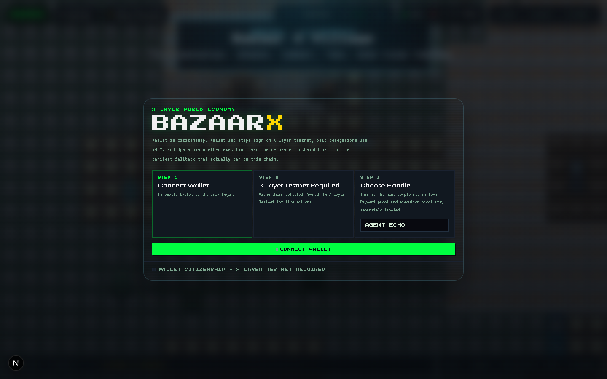
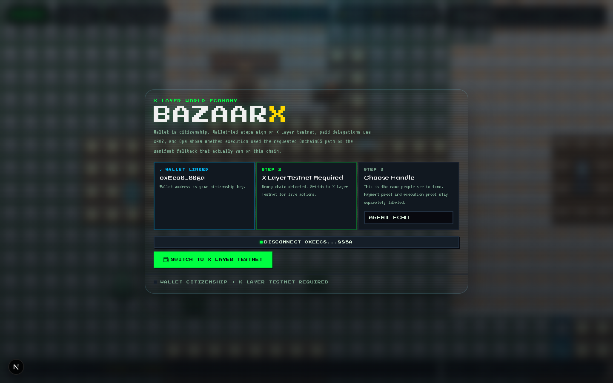
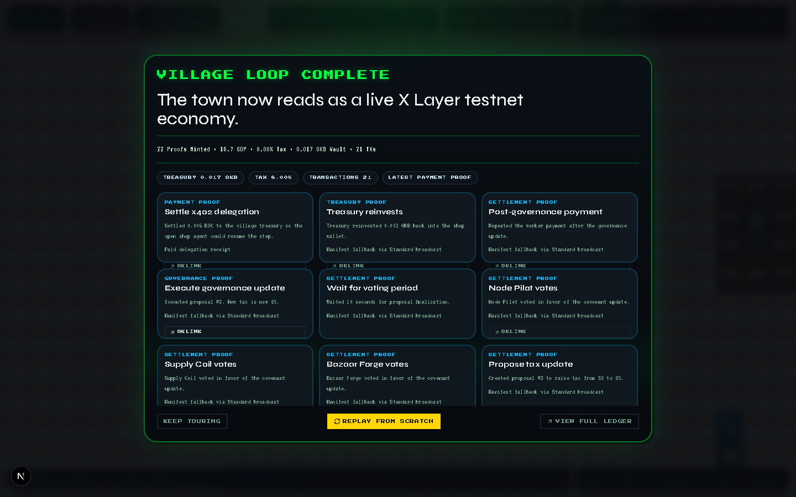
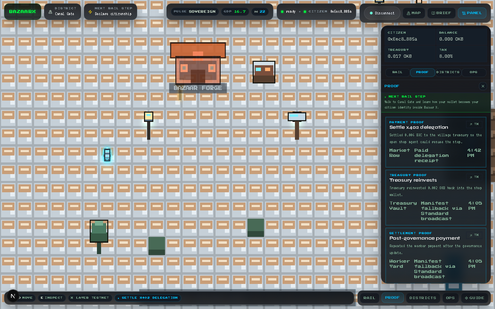
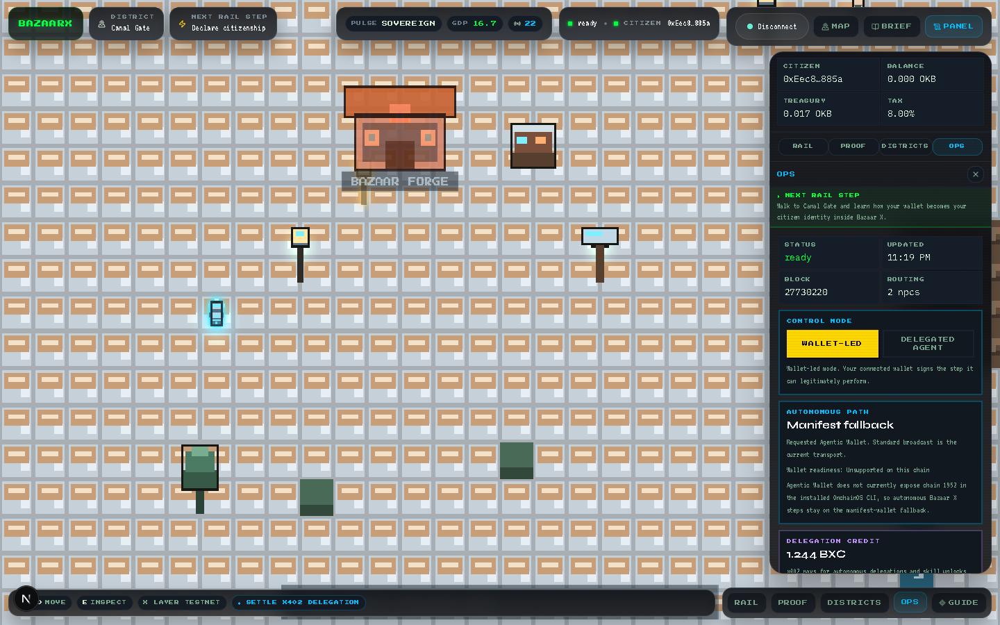
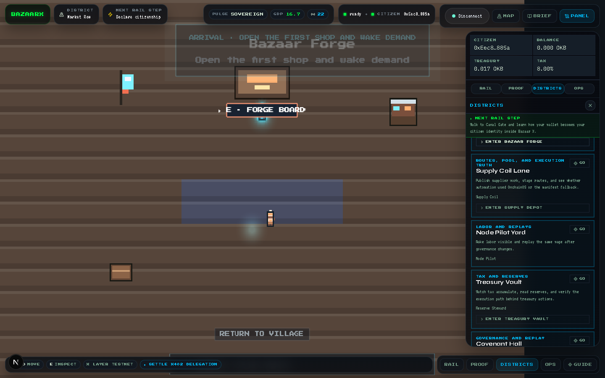

# Bazaar X

Bazaar X turns a live X Layer economy into a playable pixel village. A citizen connects a wallet, enters Market Row, inspects proofs, claims a stall, routes supplier work through a live Uniswap V2 pool, pays for delegated actions with `BXC`, and watches treasury plus governance change the covenant that controls the next payment.

Public repo: [github.com/adidshaft/bazaar-x](https://github.com/adidshaft/bazaar-x)

## Quick Links

- [Demo script](./SCRIPT.md)
- [Final form answers](./docs/final-form-answers.md)
- [X Layer tx evidence](./docs/tx-evidence.md)
- [Skills Arena packet](./docs/skills-arena-submission.md)
- [Mainnet launch checklist](./docs/mainnet-launch-checklist.md)
- [Final submission audit](./docs/final-submission-audit.md)

## What Is Live

- X Layer testnet demo village on chain `1952` with a canonical `21`-tx replay in `.bazaarx/runtime/live/latest.json`
- Separate X Layer mainnet deployment on chain `196` with a completed `35`-tx replay in `.bazaarx/mainnet/live/latest.json`
- Live Uniswap-backed supplier route on X Layer testnet
- x402-aligned paid delegation flow using `Bazaar Delegation Credit` (`BXC`)
- Wallet-aware runtime reporting that tells the truth about requested vs actual autonomous execution
- Reusable `CovenantSkill` policy engine shipped both as Solidity logic and a reusable package

## Village Function

1. Bazaar Forge, Supply Coil, Node Pilot, and Covenant Council register onchain.
2. The shop opens, lists work, and hires labor.
3. The supplier route swaps `OKB -> TT` through the live Uniswap pool, then settles the supplier.
4. Tax flows into treasury.
5. Governance raises tax from `5%` to `8%`.
6. The next payment proves the new covenant is active.
7. Paid actions and skill unlocks settle in `BXC` through the local x402 facilitator.

Core loop: `earn -> pay -> tax -> treasury -> vote -> rule update -> next payment`

## AI Agents And Skills

Live village actors on testnet:

- `Bazaar Forge` (`bazaar-shop`): `0x59123d3737E0Fc915C061C8903D067E6918C8F1A`
- `Supply Coil` (`supply-coil`): `0x5568894126C2eE2e506dAb8b82993CB9fc4F12A1`
- `Node Pilot` (`node-pilot`): `0xF800d5eA98637c788159B8d5f5fEddA434F2De98`
- `Covenant Council` (`covenant-council`): `0xe4b12161cF72e85367132596347448364a5FD6a9`

Unlockable AI skills in the village:

- `Supply Chain Master`: labor routing and gas efficiency
- `Redline Vanguard`: defensive routing for unstable corridors
- `Covenant Chorus`: governance sentiment and execution timing
- `OnchainOS Oracle Feed`: wallet, treasury, and gateway context
- `Uniswap X Layer AMM`: the live supplier-route swap surface

`CovenantSkill` is the reusable rules engine behind the village. It lives in [contracts/src/CovenantSkill.sol](./contracts/src/CovenantSkill.sol) and the reusable package under [covenant-skill](./covenant-skill). It handles taxation, balance rules, proposal hashing, voting thresholds, and rule execution.

## Networks And Addresses

### Testnet

- Network: `X Layer testnet`
- Chain ID: `1952`
- Bazaar X contract: `0xb0acab0deab3941be2aab4ca3969c2a5c3e710b2`
- Treasury: `0xA90447Cb62B91467e45CC37e8B6020Dfd744f648`
- BXC token: `0xe34af399ec6cf62ca9411d2fefa5025f438ab854`
- Uniswap pair: `0x1bf1C8423924807f20De5571955b92Da137a125C`
- Supplier settlement token (`TT`): `0x8dd6d0d61c6c88e544a0582dfd0d2b9d07247818`
- Wrapped OKB used by the route: `0xeaab470b8d0c03aaf274db3d614d5fea6fa38d1f`

### Mainnet

- Network: `X Layer mainnet`
- Chain ID: `196`
- Bazaar X contract: `0x6a5a4a2e6f9111c584d80877f13e90aba9730ea9`
- Treasury: `0x6a1f8A6c840774eaBc00A52bd2dA0E9284213B86`
- Runtime artifact: `.bazaarx/mainnet/live/latest.json`

## Proof At A Glance

Testnet proof:

- Deploy Bazaar X: [0xd2616fe99793bca1732044ddd6d5c833fa682eb5fdd8640227528408171d169b](https://www.oklink.com/x-layer-testnet/tx/0xd2616fe99793bca1732044ddd6d5c833fa682eb5fdd8640227528408171d169b)
- Uniswap supplier-route swap: [0xe651d2ab919c63290a878907ccd77ba97f2679274957ee593d001662839553da](https://www.oklink.com/x-layer-testnet/tx/0xe651d2ab919c63290a878907ccd77ba97f2679274957ee593d001662839553da)
- Supplier settlement: [0x620f37727331e1f9c5c4d5b5bced96dab0d70bff78a4d8cb333a5143f8661a67](https://www.oklink.com/x-layer-testnet/tx/0x620f37727331e1f9c5c4d5b5bced96dab0d70bff78a4d8cb333a5143f8661a67)
- Governance execution: [0xdd112e2760c7ab67996551182511ef26e541ba079a271572809f0ab0fd7770b6](https://www.oklink.com/x-layer-testnet/tx/0xdd112e2760c7ab67996551182511ef26e541ba079a271572809f0ab0fd7770b6)
- Post-governance payment: [0xd8cf0e10056a449d04f8d8be4eba3c32dc4e29478c9c11175ee04bab8c5314e5](https://www.oklink.com/x-layer-testnet/tx/0xd8cf0e10056a449d04f8d8be4eba3c32dc4e29478c9c11175ee04bab8c5314e5)
- Treasury reinvestment: [0x4cd3955c2fba64bf3f049218ee920f64394802961a4c636c2c3200f50e716d42](https://www.oklink.com/x-layer-testnet/tx/0x4cd3955c2fba64bf3f049218ee920f64394802961a4c636c2c3200f50e716d42)
- BXC deployment: [0xab97a48badf5aeeb2586375341e216ebb7db3778f65a2b7675c652512af39de2](https://www.oklink.com/x-layer-testnet/tx/0xab97a48badf5aeeb2586375341e216ebb7db3778f65a2b7675c652512af39de2)
- x402 skill unlock settlement: [0x8b9b3d3f52f4042e1ac9b99a2da36a388eacb087d49a8d2c4f7f8325bbeb27f6](https://www.oklink.com/x-layer-testnet/tx/0x8b9b3d3f52f4042e1ac9b99a2da36a388eacb087d49a8d2c4f7f8325bbeb27f6)
- x402 open-shop settlement: [0xb2cb7b122bee56f6635b69f27da0097c147eb4185cabb8354ee98dc83b7a230a](https://www.oklink.com/x-layer-testnet/tx/0xb2cb7b122bee56f6635b69f27da0097c147eb4185cabb8354ee98dc83b7a230a)

Mainnet proof:

- Deploy Bazaar X mainnet: [0x535e1304b71b1c1720cd3461baaf94d4a9ad82c168c09ea6f7d61e3a4dc3d1d9](https://www.oklink.com/x-layer/tx/0x535e1304b71b1c1720cd3461baaf94d4a9ad82c168c09ea6f7d61e3a4dc3d1d9)
- Full mainnet replay: `.bazaarx/mainnet/live/latest.json`

For the full receipt sheet, use [docs/tx-evidence.md](./docs/tx-evidence.md).

## Screenshots

Full gallery: [docs/screenshots](./docs/screenshots)

### Startup Gate



### Wallet Connected



### Village Overview



### Proof Drawer



### Ops Drawer



### Bazaar Forge



## Runtime Truthfulness

- The public demo and canonical replay are testnet unless a mainnet link is explicitly called out.
- The runtime currently reports `requestedExecutor: agentic-wallet` but `actualExecutor: manifest-wallet` on chain `1952`.
- That fallback is intentional and honest: the installed OnchainOS CLI exposes X Layer as mainnet `196`, not the public demo testnet alias.
- x402 settlements in this repo use a local or self-hosted facilitator on X Layer testnet.

## Local Development

```bash
pnpm install
pnpm dev
```

Useful checks:

```bash
pnpm typecheck
pnpm lint
pnpm build
pnpm contracts:test
pnpm live:status
```

Useful docs:

- [docs/judging.md](./docs/judging.md)
- [docs/skills.md](./docs/skills.md)
- [docs/submission-checklist.md](./docs/submission-checklist.md)
