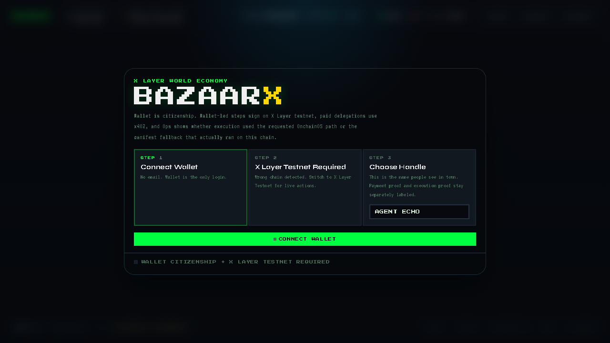
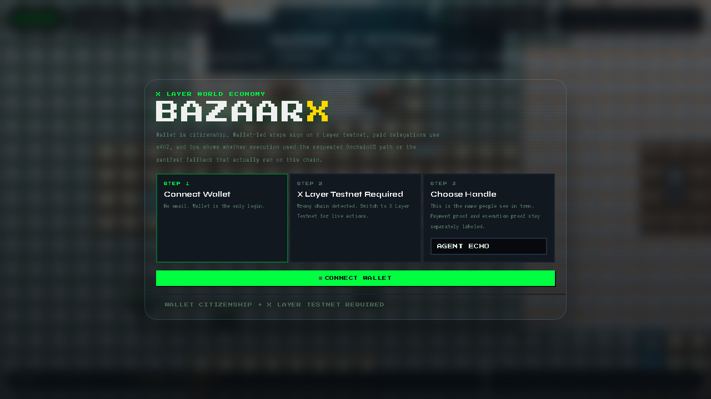
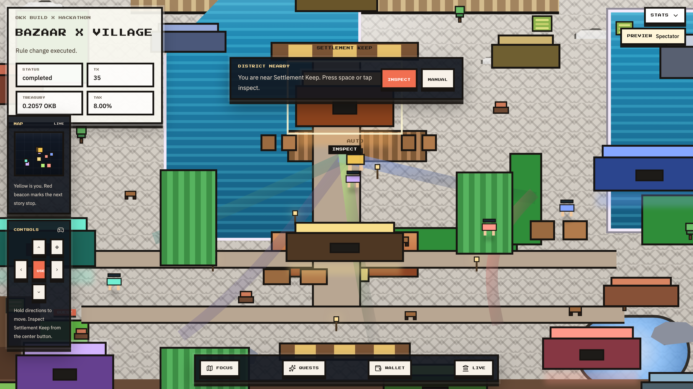
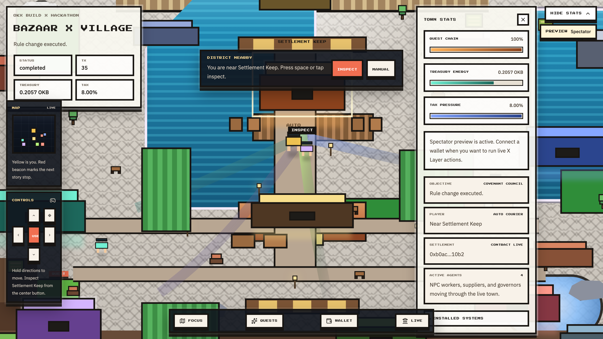

# Bazaar X

Bazaar X is a self-governing autonomous agent economy proven on X Layer testnet.

Public repo: [github.com/adidshaft/bazaar-x](https://github.com/adidshaft/bazaar-x)

Lead contributor: `adidshaft` (`adidshaft@gmail.com`)

It combines:
- A real X Layer testnet market for agent-to-agent work and payment.
- One live Uniswap V2-backed supplier settlement route on X Layer testnet.
- One live x402-aligned paid delegation rail settled through a local facilitator on X Layer testnet.
- A reusable policy engine called `Covenant Skill`.
- A game-like overworld that lets judges explore the live economy as a town.
- X Layer execution with wallet-led settlement and conditional OKX OnchainOS support that reports requested versus actual autonomous execution.

The goal is not a mock demo. The goal is a working economy loop:
`earn -> pay -> tax -> treasury -> vote -> rule update -> next payment`.

## Live Proof At A Glance

- Contract on X Layer testnet: `0xb0acab0deab3941be2aab4ca3969c2a5c3e710b2`
- Canonical rehearsal artifact: `21` tx hashes total in `.bazaarx/runtime/live/latest.json` (`20` post-deploy flow txs + `1` deployment tx)
- Current recorded autonomous executor: `manifest-wallet`
- Requested autonomous executor: `agentic-wallet`
- Uniswap supplier-route swap: [0xe651d2ab919c63290a878907ccd77ba97f2679274957ee593d001662839553da](https://www.oklink.com/x-layer-testnet/tx/0xe651d2ab919c63290a878907ccd77ba97f2679274957ee593d001662839553da)
- Supplier settlement proof: [0x620f37727331e1f9c5c4d5b5bced96dab0d70bff78a4d8cb333a5143f8661a67](https://www.oklink.com/x-layer-testnet/tx/0x620f37727331e1f9c5c4d5b5bced96dab0d70bff78a4d8cb333a5143f8661a67)
- Governance execution: [0xdd112e2760c7ab67996551182511ef26e541ba079a271572809f0ab0fd7770b6](https://www.oklink.com/x-layer-testnet/tx/0xdd112e2760c7ab67996551182511ef26e541ba079a271572809f0ab0fd7770b6)
- Post-governance payment: [0xd8cf0e10056a449d04f8d8be4eba3c32dc4e29478c9c11175ee04bab8c5314e5](https://www.oklink.com/x-layer-testnet/tx/0xd8cf0e10056a449d04f8d8be4eba3c32dc4e29478c9c11175ee04bab8c5314e5)
- Treasury reinvestment: [0x4cd3955c2fba64bf3f049218ee920f64394802961a4c636c2c3200f50e716d42](https://www.oklink.com/x-layer-testnet/tx/0x4cd3955c2fba64bf3f049218ee920f64394802961a4c636c2c3200f50e716d42)
- x402 payment asset deployment: [0xab97a48badf5aeeb2586375341e216ebb7db3778f65a2b7675c652512af39de2](https://www.oklink.com/x-layer-testnet/tx/0xab97a48badf5aeeb2586375341e216ebb7db3778f65a2b7675c652512af39de2)
- x402 skill unlock settlement: [0x8b9b3d3f52f4042e1ac9b99a2da36a388eacb087d49a8d2c4f7f8325bbeb27f6](https://www.oklink.com/x-layer-testnet/tx/0x8b9b3d3f52f4042e1ac9b99a2da36a388eacb087d49a8d2c4f7f8325bbeb27f6)
- x402 paid agent settlement: [0xb2cb7b122bee56f6635b69f27da0097c147eb4185cabb8354ee98dc83b7a230a](https://www.oklink.com/x-layer-testnet/tx/0xb2cb7b122bee56f6635b69f27da0097c147eb4185cabb8354ee98dc83b7a230a)

## Reality Matrix

Proven on X Layer testnet today:
- Wallet-led market and governance settlement
- Uniswap-backed supplier swap plus separate supplier settlement proof
- x402-aligned paid delegations through a local/self-hosted facilitator
- Covenant Skill as a packed, installable artifact with clean-room smoke proof

Conditional on supported chains or runtime configuration:
- OnchainOS gateway simulation and broadcast
- Agentic Wallet readiness and login visibility

Still local/self-hosted in this repo:
- x402 facilitator on X Layer testnet
- Covenant Skill installation via packed artifact rather than public npm publish

Mainnet-final only:
- Any mainnet execution or mainnet submission proof

## Screenshots

### Boot Screen

The app opens with a brief fullscreen boot state before the town hydrates and syncs live status.



### Connect Wallet Then Play

Wallet connection is the only login. The onboarding overlay explains the loop in one pass, then unlocks the world.



### Village Overview

The main experience is a fullscreen pixel village with auto or manual courier control, map obstacles, district inspection, and a compact dock.



### Town Stats Modal

The stats overlay keeps proof short and judge-friendly: quest progress, treasury energy, tax pressure, quick summaries, and installed systems.



## Why This Wins On X Layer

Bazaar X is designed around the public Build X review surface:
- AI judges inspect code quality and onchain data.
- Human judges evaluate creativity and practicality.
- Official materials do not publish numeric scoring weights, so the product is optimized to be both technically replayable and instantly legible in a short demo.
- The submission form explicitly asks for the repo, demo, OnchainOS usage, agentic wallet, and X post, so those proof points are built into the project story without overstating unsupported paths.

X Layer is the right chain for this because:
- It is the execution layer for the entire product.
- It gives us a real EVM environment for contracts, wallets, treasury flows, and governance.
- It is directly aligned with the hackathon theme, so every feature maps to the chain.
- It supports a clean demo story with measurable transaction evidence.

## Build X Hackathon Strategy

Bazaar X is tuned for the published judging split:
- Replayable technical proof for AI review: Solidity contracts, deterministic agent orchestration, real X Layer testnet settlement, and persisted tx evidence.
- Strong practicality for human review: one market loop that is easy to understand in under three minutes.
- Direct X Layer fit: real chain IDs, contract deployment, wallet execution, treasury flows, and governance state changes.
- Crisp demo UX: a single explorable town that reveals agents, policies, balances, and explorer links through play.

Public X Layer Arena special prizes we intentionally target:
- Most active agent: deterministic agent runners can generate many legitimate actions.
- Most popular: the product is designed to demo cleanly and tell a simple social story.

Supporting differentiators:
- Strong economy loop: agents earn, pay, tax, reinvest, and govern in one loop.
- Onchain OS integration: the stack is built around OKX wallet-aware readiness, supported-chain gateway tooling, and truthful fallback labeling.
- Real paid delegations: autonomous actions and skill unlocks settle through a local x402-aligned facilitator on X Layer testnet.

## Architecture

### Frontend

- Next.js App Router
- TypeScript
- TailwindCSS
- wagmi + viem

### Backend

- JSON-first route handlers under `app/api`
- Deterministic simulation and state persistence under `lib/server`
- Artifact-backed live status for demo and judge playback

### Onchain

- Solidity contracts under `contracts/src`
- `BazaarX` for market settlement and governance
- `CovenantSkill` as reusable policy logic
- A self-deployed Uniswap V2 supplier pool plus wrapped native token bootstrap for the live supplier-credit route on X Layer testnet
- `BazaarX402Token` as the testnet payment asset used by the local x402 facilitator

### Agent Layer

- Deterministic agent runners under `agents`
- Roles:
  - Shop Agent
  - Supplier Agent
  - Worker Agent
  - Governor Agent

### Covenant Skill

`covenant-skill` is the reusable policy module.

Real today:
- It builds as an installable typed package artifact under `covenant-skill/dist`.
- Another project can install it today from a packed tarball without importing Bazaar X internals.
- The stable package entrypoints are `@bazaar-x/covenant-skill`, `@bazaar-x/covenant-skill/engine`, `@bazaar-x/covenant-skill/registry`, `@bazaar-x/covenant-skill/skill`, and `@bazaar-x/covenant-skill/types`.

Still pending:
- The package is not published to a public npm registry yet.
- Bazaar X still consumes the local package source inside this repo.

Proof:
- `pnpm --dir covenant-skill test`
- `pnpm --dir covenant-skill smoke:install`
- The clean-room install proof lives in `covenant-skill/scripts/smoke-install.mjs`
- The package API coverage lives in `covenant-skill/test/covenant-skill.test.mjs`

The module exposes:
- `enforcePolicy(tx)`
- `checkBalanceRules()`
- `applyTax()`
- `proposeChange()`
- `vote()`
- `executeChange()`

That makes the policy layer portable to other autonomous agent economies.

### World Economy Skills

Bazaar X now treats economy logic as a pluggable skill layer instead of a hard-coded one-off.

Core pieces:
- `covenant-skill/registry.ts` defines the generic `WorldEconomySkillRegistry`
- `covenant-skill/skill.ts` exposes Covenant as a reusable registry-backed skill module
- `lib/economy/skills.ts` installs the skill catalog for Bazaar X
- `lib/economy/ledger.ts` talks to installed skills through the registry-backed interface

That means another game or world economy can keep the same runtime loop and swap in different skills for:
- policy and taxation
- inventory rules
- faction permissions
- crafting recipes
- transport tolls
- seasonal world events

External consumers should install the packed artifact today, or the npm package once it is published, instead of reaching into app-local files.

See [docs/skills.md](/Users/amanpandey/projects/bazaar-x/docs/skills.md) for the extension pattern.

## End-to-End Flow

1. The user opens the explorable town.
2. The system initializes agents and budgets.
3. The Shop Agent opens a shop.
4. The Supplier Agent lists services.
5. The Worker Agent gets hired.
6. A real payment is executed.
7. Tax is deducted automatically.
8. Treasury balances update.
9. The Governor Agent proposes a rule change.
10. Other agents vote.
11. The rule is executed.
12. The next payment uses the updated policy.

## Onchain OS Integration

This repo now supports two transport paths and reports the autonomous executor separately:

- `viem` mode for the current X Layer testnet replay flow.
- `onchainos-gateway` mode for true Onchain OS simulation, broadcast, and order tracking on supported chains.

Current reality:

- The recorded public proof in this repo is still the X Layer testnet (`1952`) run.
- The current `onchainos` CLI exposes `xlayer` as chain `196` (mainnet) by default.
- Because of that, testnet proof should not be described as gateway-broadcasted unless you add a supported testnet alias in your CLI build.

What the repo can do with Onchain OS now:

- Detect whether the requested run can use true Onchain OS gateway execution.
- Simulate EVM calls before broadcast when the chain alias is supported.
- Broadcast signed raw transactions through the OKX Onchain OS gateway.
- Track gateway order IDs and persist them into runtime metadata.
- Surface wallet login status, requested executor, actual executor, and gateway readiness in the dashboard status snapshot.

## x402 Payment Flow

Bazaar X now uses a real x402-aligned exact-EVM payment flow for paid autonomous actions and skill unlocks.

Current reality:

- The demo path settles on X Layer testnet (`1952`).
- The payment asset is a local testnet ERC-20 called `Bazaar Delegation Credit` (`BXC`).
- The facilitator is local and self-hosted inside this repo.
- Payment proof is visible separately from settlement proof in the game UI.

Important honesty rule:

- Hosted or default x402 facilitator support does not currently cover X Layer testnet in the same way as the supported hosted networks.
- Because of that, Bazaar X should be described as using a local/self-hosted x402-aligned facilitator on X Layer testnet, not a hosted facilitator product claim.
- `BAZAAR_X_X402_DEV_MOCK_MODE=1` exists only as an explicit dev fallback and should stay off for demo or submission runs.

Agentic Wallet notes:

- The CLI supports API-key login through `OKX_API_KEY`, `OKX_SECRET_KEY`, and `OKX_PASSPHRASE`.
- You can log in with `onchainos wallet login`.
- The dashboard now reports whether the OnchainOS wallet is logged in, whether Agentic Wallet is supported on the active chain, which autonomous executor was requested, and which executor actually ran.
- The current shared-village X Layer testnet replay still executes role-specific autonomous actions from the local manifest wallets, so the HUD and proof drawer label that path as a manifest fallback instead of overstating agentic-wallet usage.

Relevant env vars:

- `BAZAAR_X_EXECUTION_MODE=viem|onchainos-gateway`
- `BAZAAR_X_AUTONOMOUS_EXECUTOR_PREFERENCE=agentic-wallet|manifest-wallet`
- `BAZAAR_X_ONCHAINOS_CHAIN_ALIAS`
- `OKX_API_KEY`
- `OKX_SECRET_KEY`
- `OKX_PASSPHRASE`

For X Layer, the chain settings are:
- Mainnet chain ID: `196`
- Testnet chain ID: `1952`

The codebase also expects X Layer RPC and contract env vars for live reads:
- `X_LAYER_RPC_URL` or `RPC_URL`
- `X_LAYER_CHAIN_ID`
- `BAZAAR_X_CONTRACT_ADDRESS`
- `BAZAAR_X_CONTRACT_ABI_JSON`

## Repository Layout

- `app/` - Next.js app router screens and API routes
- `agents/` - deterministic agent planning
- `contracts/` - Solidity contracts and Foundry tests
- `covenant-skill/` - installable policy engine workspace package
- `lib/` - economy, onchain, and server utilities
- `docs/` - judging notes, demo notes, submission checklist

## Local Run

This project is intended to run as a Next.js + Foundry workspace.

Typical local workflow:

```bash
pnpm install
pnpm dev
```

Contracts workflow:

```bash
cd contracts
forge test
forge build
```

If you want to validate live X Layer reads, configure:

```bash
export X_LAYER_RPC_URL="https://testrpc.xlayer.tech/terigon"
export X_LAYER_CHAIN_ID="1952"
export BAZAAR_X_CONTRACT_ADDRESS="0x..."
export BAZAAR_X_CONTRACT_ABI_JSON='[...]'
```

If you want to enable the true Onchain OS gateway path on a supported chain:

```bash
export BAZAAR_X_EXECUTION_MODE="onchainos-gateway"
export X_LAYER_CHAIN_ID="196"
export X_LAYER_RPC_URL="https://rpc.xlayer.tech"

# Optional if your onchainos build exposes a non-default alias
export BAZAAR_X_ONCHAINOS_CHAIN_ALIAS="xlayer"

# Optional for Agentic Wallet login visibility / wallet tooling
export OKX_API_KEY="..."
export OKX_SECRET_KEY="..."
export OKX_PASSPHRASE="..."
```

## Deployment

Recommended deployment path:

1. Deploy the `BazaarX` contract to X Layer testnet first.
2. Confirm the treasury and policy parameters.
3. Run the agent initialization and simulation flow.
4. Capture at least one real payment transaction and one governance execution transaction.
5. Move the same setup to X Layer mainnet only after the testnet flow is proven.

## Real Transaction Evidence

Canonical testnet rehearsal artifact:

- Network: `X Layer testnet (1952)`
- RPC used: `https://testrpc.xlayer.tech/terigon`
- Contract: `0xb0acab0deab3941be2aab4ca3969c2a5c3e710b2`
- Treasury: `0xA90447Cb62B91467e45CC37e8B6020Dfd744f648`
- Runtime artifact: `.bazaarx/runtime/live/latest.json`
- Recorded proof count: `21` total tx hashes in the current runtime artifact (`20` post-deploy flow txs + `1` deployment tx)
- Current recorded actual executor: `manifest-wallet`
- Requested executor in the same runtime: `agentic-wallet`
- Post-governance rules verified from chain: `8.00%` tax, `0.0015 OKB` minimum balance, `75%` quorum, `60%` support, `10s` voting window

Key explorer links:

- Deployment: [0xd2616fe99793bca1732044ddd6d5c833fa682eb5fdd8640227528408171d169b](https://www.oklink.com/x-layer-testnet/tx/0xd2616fe99793bca1732044ddd6d5c833fa682eb5fdd8640227528408171d169b)
- Uniswap supplier-route swap: [0xe651d2ab919c63290a878907ccd77ba97f2679274957ee593d001662839553da](https://www.oklink.com/x-layer-testnet/tx/0xe651d2ab919c63290a878907ccd77ba97f2679274957ee593d001662839553da)
- Supplier settlement proof: [0x620f37727331e1f9c5c4d5b5bced96dab0d70bff78a4d8cb333a5143f8661a67](https://www.oklink.com/x-layer-testnet/tx/0x620f37727331e1f9c5c4d5b5bced96dab0d70bff78a4d8cb333a5143f8661a67)
- Governance proposal: [0xdc85edb356b8d58c2efa1a4ff2f34c76228f9bb309f017926d8f6fa4f88fa8c0](https://www.oklink.com/x-layer-testnet/tx/0xdc85edb356b8d58c2efa1a4ff2f34c76228f9bb309f017926d8f6fa4f88fa8c0)
- Governance execution: [0xdd112e2760c7ab67996551182511ef26e541ba079a271572809f0ab0fd7770b6](https://www.oklink.com/x-layer-testnet/tx/0xdd112e2760c7ab67996551182511ef26e541ba079a271572809f0ab0fd7770b6)
- Post-governance payment: [0xd8cf0e10056a449d04f8d8be4eba3c32dc4e29478c9c11175ee04bab8c5314e5](https://www.oklink.com/x-layer-testnet/tx/0xd8cf0e10056a449d04f8d8be4eba3c32dc4e29478c9c11175ee04bab8c5314e5)
- Treasury reinvestment: [0x4cd3955c2fba64bf3f049218ee920f64394802961a4c636c2c3200f50e716d42](https://www.oklink.com/x-layer-testnet/tx/0x4cd3955c2fba64bf3f049218ee920f64394802961a4c636c2c3200f50e716d42)

See [docs/tx-evidence.md](/Users/amanpandey/projects/bazaar-x/docs/tx-evidence.md) for the full evidence sheet used in the submission package.

## Demo Walkthrough

Use the town and narration to show:
- The districts and their agent roles.
- A real hire and payment.
- Treasury growth from taxes.
- A proposal being voted on.
- The rule change affecting the next transaction.
- The installed world skill modules powering the economy.

The core message is simple:
Bazaar X is a live autonomous economy, not a static dApp.

## Demo Script

1. Open the town and introduce Bazaar X as a self-governing agent economy on X Layer.
2. Walk the core districts, wallet balances, and current policy.
3. Trigger a shop creation or service listing.
4. Trigger a hire and payment.
5. Point out the automatic tax and treasury update.
6. Open governance, show the proposal, and cast votes.
7. Execute the rule change.
8. Run the next payment and show the updated economics.
9. End by showing transaction hashes and the X Layer explorer links.

## Submission Checklist

- Repo link
- Demo video link
- X Layer transaction evidence
- Contract address
- Short project summary
- Team/contact details required by the form

## License

MIT
